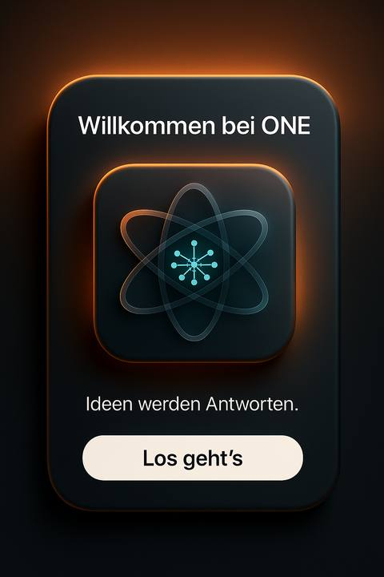
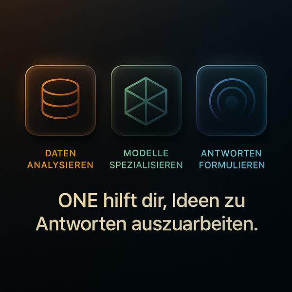
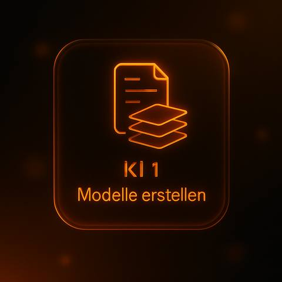

<div align="center">


# ONE — Parallel AI Chat for iOS

**Ask once. Hear four minds.**

[](https://swift.org)
[](https://developer.apple.com/ios/)
[](https://developer.apple.com/xcode/swiftui/)
[](https://developer.apple.com/xcode/)
[](LICENSE)
[](https://developer.apple.com)


> ONE sends your prompt simultaneously to **Gemini**, **Claude**, **Mistral** and **ChatGPT** —  
> streams every token live — then lets ChatGPT synthesise all three answers into one verdict.

<br/>

<!-- Story-/Werbe-Renders – horizontale Leiste. Echte UI-Screenshots folgen weiter unten unter „App Story". -->

&nbsp;

&nbsp;

&nbsp;

&nbsp;


</div>

---

## App Story

> One prompt. Four perspectives. One synthesis.  
> Here's what using ONE actually looks like — from first tap to final verdict.

<br/>

---

### ① First launch — set up in 60 seconds

<div align="center">


</div>

<div align="center">

**Enter your four API keys once. That's it.**  
Keys are stored in the iOS Keychain — never in iCloud, never in your code.  
You can update or replace them anytime via the ⚙️ Settings screen.

*→ Replace with: screenshot of OnboardingView with the four key input fields*

</div>

<br/>

---

### ② Ask anything — one input, four recipients

<div align="center">


</div>

<div align="center">

**Type your question. Tap Send. Done.**  
ONE automatically plans the most effective prompt variation for each agent  
and dispatches all three in parallel — before you've finished reading.

*→ Replace with: screenshot of GlassCardInputField with a question typed in*

</div>

<br/>

---

### ③ The core experience — four minds, live, in parallel

<div align="center">


</div>

<div align="center">

**This is what ONE is for.**  
Gemini researches. Claude structures. Mistral distills.  
Every token appears the instant it arrives — three streams, one screen, zero waiting.

*→ Replace with: screenshot of GridAgentCardsView with all three cards mid-stream*

</div>

<br/>

---

### ④ Go deeper — the full answer at a tap

<div align="center">


</div>

<div align="center">

**Tap any card to read the complete response.**  
No truncation, no scrolling inside a tiny card.  
Copy the full text to clipboard with one tap.

*→ Replace with: screenshot of FullAnswerAgentSheet open (e.g. Claude's response)*

</div>

<br/>

---

### ⑤ The verdict — ChatGPT cross-checks everything

<div align="center">


</div>

<div align="center">

**After all three agents finish, ChatGPT takes over.**  
It reviews every answer against your original prompt, flags contradictions,  
and delivers one synthesised, fact-checked verdict — streamed live.

*→ Replace with: screenshot showing the ChatGPT final reply card appearing below the grid*

</div>

<br/>

---

### ⑥ Two layouts — switch any time

<div align="center">


&nbsp;&nbsp;&nbsp;&nbsp;


</div>

<div align="center">

**2×2 Grid** — equal cards, maximum overview &nbsp;&nbsp;&nbsp;&nbsp;&nbsp;&nbsp;&nbsp;&nbsp; **Stacked Deck** — focused, scrollable, one at a time

Tap the layout toggle in the top bar to switch. The transition is animated.

*→ Replace with: Grid screenshot on the left, Stacked screenshot on the right*

</div>

<br/>

---

### ⑦ Your full history — always there

<div align="center">


</div>

<div align="center">

**Every conversation is saved automatically as JSON.**  
Swipe from the left (or tap ☰) to open the history sidebar.  
Tap any session to jump back. Swipe left to delete.

*→ Replace with: screenshot of HistorySidebarView open, showing 3–4 past conversations*

</div>

<br/>

---

## What Is ONE?

ONE is a native **SwiftUI** app for iOS that eliminates the "which AI should I ask?" dilemma by asking all four at once. Every response streams token-by-token in real time via **Server-Sent Events (SSE)**. A built-in 3-stage orchestration pipeline plans, parallelises, and synthesises — so you get breadth *and* depth in a single tap.

---

## Features

### Core Experience

| Feature | Detail |
|---|---|
| **4 Agents in Parallel** | Gemini 1.5 Flash · Claude 3.5 Haiku · Mistral Small · GPT-4o Mini |
| **Token-for-Token Streaming** | SSE (`URLSession` byte-stream) for all 4 APIs simultaneously |
| **3-Stage Orchestration** | Plan → Parallel fetch → Final ChatGPT synthesis & fact-check |
| **2 Layout Modes** | 2×2 Grid ↔ Stacked deck, animated toggle |
| **Skeleton Shimmer** | Pulsing placeholder animation while agents respond |
| **Error Cards** | Orange stroke + readable message — zero crashes on API failure |
| **Full-Answer Sheet** | Tap any card → full text, one-tap Copy to Clipboard |
| **History Sidebar** | All conversations persisted as JSON; Swipe-to-Delete |
| **Onboarding Flow** | Guided API-key setup on first launch |
| **In-App Settings** | Edit keys at any time via ⚙️ — hot-swap without restart |

### Security & Privacy

| Feature | Detail |
|---|---|
| **Keychain Storage** | All 4 API keys stored in iOS Keychain via `SecureKeyManager` |
| **Git-Safe Config** | `Secrets.local.xcconfig` is gitignored; template committed instead |
| **DEBUG Key Injector** | `DeveloperKeyInjector` injects keys only in `#if DEBUG` builds |
| **No Telemetry** | Zero analytics, zero tracking — your prompts stay on-device |

### Polish

- **Dark Mode** throughout — glass morphism design system
- **VoiceOver Accessibility** — all interactive elements fully labelled with `.accessibilityLabel`, hints, and `.updatesFrequently` for streaming text
- **Auto-scroll** to latest message during streaming
- **Keyboard-aware** input bar via `safeAreaInset`
- **Welcome screen** on fresh start or "New Chat"

---

## Architecture

Strict **MVVM** with Dependency Injection via protocol. Zero business logic in Views.

```
┌─────────────────────────────────────────────────────────────────┐
│                         View Layer                              │
│  ContentView                                                    │
│  ├── TopBarView          (logo | layout toggle | ⚙️ | new chat) │
│  ├── ChatMessageListView (scroll list + welcome state)          │
│  │   ├── UserPromptBubbleView                                   │
│  │   ├── GridAgentCardsView      ← 2×2 grid layout             │
│  │   └── StackedAgentCardsView   ← tappable deck layout        │
│  │       └── AgentCardView  (shimmer | error | streaming text)  │
│  │           └── FullAnswerAgentSheet  (full text + copy)       │
│  ├── GlassCardInputField                                        │
│  └── HistorySidebarView          (swipe-to-delete)             │
└────────────────────┬────────────────────────────────────────────┘
                     │ @Published / @ObservedObject
┌────────────────────▼────────────────────────────────────────────┐
│                     ViewModel Layer                             │
│  ConversationViewModel   @MainActor                             │
│  ├── runFreeFlowStep()   plan → parallel stream → synthesise    │
│  ├── @Published var rounds: [ConversationRound]                 │
│  └── @Published var layoutMode: LayoutMode                      │
└────────────────────┬────────────────────────────────────────────┘
                     │ ConversationProtocol (DI)
          ┌──────────┴───────────┐
          ▼                      ▼
   RealConversationService   MockConversationService
   ├── GeminiAPIClient           (word-by-word typing effect,
   ├── ClaudeAPIClient            no real keys needed)
   ├── MistralAPIClient
   └── ChatGPTAPIClient

┌─────────────────────────────────────────────────────────────────┐
│                       Data Layer                                │
│  Models (Codable value types)                                   │
│  ConversationRound → [ChatStep] → [AgentType: String]           │
│                                                                 │
│  Managers                                                       │
│  SecureKeyManager    – Keychain read / write / delete           │
│  PersistenceManager  – UserDefaults JSON encode / decode        │
└─────────────────────────────────────────────────────────────────┘
```

### Key Design Decisions

| Decision | Rationale |
|---|---|
| `ConversationProtocol` DI | `RealConversationService` & `MockConversationService` swap without touching ViewModel |
| `withTaskGroup` for parallel calls | Progressive UI: each card fills the moment *its* agent responds |
| `@MainActor` ViewModel | All `@Published` mutations on main thread — no `DispatchQueue` noise |
| Value types (`struct`) for models | Thread-safe by default; copy semantics prevent async race conditions |
| Protocol-extension streaming defaults | `fetchAgentStream` / `makeFinalStream` have fallback wrappers — no breaking change |
| `streamAgentReply` helper | Per-token UI updates accumulate in-place — smooth typing illusion |

---

## How Streaming Works

```swift
// ConversationProtocol.swift
protocol ConversationProtocol {
    // Phase 2: fetch agent stream — yields tokens as they arrive
    func fetchAgentStream(
        for agent: AgentType,
        plannedPrompt: String
    ) -> AsyncThrowingStream<String, Error>

    // Phase 3: final ChatGPT synthesis of all three answers
    func makeFinalStream(
        from agentReplies: [AgentType: String],
        userPrompt: String
    ) -> AsyncThrowingStream<String, Error>
}
```

The ViewModel consumes all three agent streams **concurrently** via `withTaskGroup`. Each token update writes directly to the corresponding agent card in real time:

```swift
// ConversationViewModel.swift
await withTaskGroup(of: Void.self) { group in
    for agent in [AgentType.gemini, .claude, .mistral] {
        let agentPrompt = plannedPrompts[agent] ?? prompt
        group.addTask {
            await self.streamAgentReply(
                agent: agent,
                plannedPrompt: agentPrompt,
                into: roundIndex,
                stepId: stepId
            )
        }
    }
    for await _ in group { }  // wait for all three
}
// Then stream the ChatGPT synthesis
for try await token in service.makeFinalStream(from: agentReplies, userPrompt: prompt) {
    finalAccumulated += token
    // update UI per token …
}
```

---

## Tech Stack

| Layer | Technology |
|---|---|
| Language | Swift 5.9 |
| UI Framework | SwiftUI |
| Concurrency | Swift Structured Concurrency (`async/await`, `withTaskGroup`, `AsyncThrowingStream`) |
| Streaming | Server-Sent Events (SSE) via `URLSession.bytes(for:).lines` |
| Persistence | `UserDefaults` (JSON) + iOS Keychain (`Security` framework) |
| AI APIs | Google Gemini 1.5 Flash · Anthropic Claude 3.5 Haiku · Mistral Small · OpenAI GPT-4o Mini |
| Min. Deployment | iOS 17.0 |
| Toolchain | Xcode 15.2+ |

---

## Getting Started

### Prerequisites

- Xcode 15.2 or newer
- iOS 17+ device or simulator
- API key for at least one provider (free tiers available for Gemini and Mistral)

### API Key Registration

| Provider | Console | Free Tier |
|---|---|---|
| **Gemini** | [Google AI Studio](https://aistudio.google.com/apikey) | ✅ Generous quota |
| **Claude** | [Anthropic Console](https://console.anthropic.com/) | Pay-as-you-go |
| **Mistral** | [Mistral AI Platform](https://console.mistral.ai/) | ✅ Free tier |
| **ChatGPT** | [OpenAI Platform](https://platform.openai.com/api-keys) | Pay-as-you-go |

### Installation

```bash
git clone https://github.com/NEO849/ONE.git
cd ONE
open ONE.xcodeproj
```

1. Select your **Team** under *Signing & Capabilities*
2. Build & Run on device or simulator (iOS 17+)
3. The **Onboarding** screen guides you through entering your four API keys
4. Keys are stored securely in the iOS Keychain — never in iCloud or source files

> **Need to update keys later?** Tap **⚙️** in the top bar at any time.

### Developer Setup (key injection for DEBUG builds)

```bash
# Option A: run the setup script (reads keys from ~/.bashrc / shell env)
bash scripts/setup-secrets.sh

# Option B: copy the template manually
cp ONE/Configuration/Secrets.xcconfig.template ONE/Configuration/Secrets.local.xcconfig
# then fill in your keys — file is gitignored
```

In DEBUG builds, `DeveloperKeyInjector` reads these values at launch and writes them to the Keychain automatically — you skip Onboarding entirely:

```swift
// DeveloperKeyInjector.swift  (#if DEBUG only — never ships)
#if DEBUG
enum DeveloperKeyInjector {
    static func injectIfNeeded() {
        let environment = ProcessInfo.processInfo.environment
        let keyMapping: [(SecureKeyManager.APIKey, String)] = [
            (.gemini,  "GEMINI_API_KEY"),
            (.claude,  "CLAUDE_API_KEY"),
            (.mistral, "MISTRAL_API_KEY"),
            (.chatGPT, "CHATGPT_API_KEY")
        ]
        for (apiKey, envVarName) in keyMapping {
            guard let rawValue = environment[envVarName],
                  !rawValue.isEmpty,
                  SecureKeyManager.load(key: apiKey) == nil
            else { continue }
            SecureKeyManager.save(key: apiKey, value: rawValue)
        }
    }
}
#endif
```

---

## Project Structure

```
ONE/
├── ONEApp.swift                           App entry — wires Real vs Mock service
├── Data/
│   ├── Manager/
│   │   ├── SecureKeyManager.swift         Keychain wrapper (save/load/delete)
│   │   └── PersistenceManager.swift       UserDefaults JSON persistence
│   ├── Model/
│   │   ├── AgentType.swift                Enum: gemini | claude | mistral | chatgpt
│   │   ├── ChatStep.swift                 One prompt + all agent responses
│   │   ├── ConversationsRound.swift       A full conversation session
│   │   ├── LayoutMode.swift               Enum: grid | stacked
│   │   └── ONEAPIError.swift              Typed errors for all 4 APIs
│   └── Service/
│       ├── ConversationProtocol.swift     DI interface + streaming defaults
│       ├── MockConversationService.swift  Word-by-word typing effect (60ms/word)
│       └── Real/
│           ├── GeminiAPIClient.swift      SSE via streamGenerateContent?alt=sse
│           ├── ClaudeAPIClient.swift      SSE via Anthropic content_block_delta
│           ├── MistralAPIClient.swift     SSE via OpenAI-compatible format
│           ├── ChatGPTAPIClient.swift     SSE via OpenAI chat completions
│           └── RealConversationService.swift  Orchestrates all 4 clients
├── UI/
│   ├── Components/
│   │   ├── AgentCardView.swift            Shimmer | error | streaming text card
│   │   ├── GridAgentCardsView.swift       2×2 equal-size grid
│   │   ├── StackedAgentCardsView.swift    Offset deck layout
│   │   ├── HistorySidebarView.swift       Slide-in sidebar, swipe-to-delete
│   │   ├── UserPromptBubbleView.swift
│   │   └── Subviews/
│   │       ├── FullAnswerAgentSheet.swift  Full text + copy-to-clipboard
│   │       └── LeftAgentNameRailView.swift
│   ├── Styles/
│   │   ├── AgentTheme.swift               Per-agent colours & asset names
│   │   ├── GlassStyles.swift              .glassCard() ViewModifier
│   │   ├── GlassLightSweepModifier.swift
│   │   ├── GlassTiltModifier.swift
│   │   └── GlassWowCardModifier.swift
│   └── Views/
│       ├── ContentView.swift              Main screen
│       ├── ChatMessageListView.swift      Scroll list + welcome empty state
│       ├── GlassCardInputField.swift      Keyboard-aware glass input bar
│       ├── OnboardingView.swift           First-launch key setup
│       ├── SettingsView.swift             Edit keys post-setup (save guard)
│       └── TopBarView.swift               Logo | toggle | settings | new chat
├── Debug/
│   └── DeveloperKeyInjector.swift        DEBUG-only key bootstrapping
├── Configuration/
│   └── Secrets.xcconfig.template         Committed template (no real values)
├── ViewModel/
│   └── ConversationViewModel.swift        @MainActor source of truth
└── ONETests/
    └── ConversationViewModelTests.swift   Unit tests (add test target in Xcode)
```

---

## Roadmap

| Status | Feature |
|---|---|
| ✅ Done | Token-for-Token SSE streaming across all 4 APIs |
| ✅ Done | 3-stage orchestration (Plan → Parallel → Synthesise) |
| ✅ Done | 2 layout modes with animated toggle |
| ✅ Done | Skeleton shimmer & error cards |
| ✅ Done | Keychain security + git-safe secret config |
| ✅ Done | Onboarding + Settings flow |
| ✅ Done | Conversation history with JSON persistence |
| ✅ Done | VoiceOver Accessibility (full coverage) |
| ✅ Done | Dark Mode + Glass design system |
| ✅ Done | Unit tests for ConversationViewModel (`ONETests/`) |
| 🔄 In Progress | iPad & Landscape layout optimisation |
| 📋 Planned | TestFlight distribution |
| 📋 Planned | Custom agent selection (add/remove providers) |
| 💡 Idea | macOS (Catalyst) support |
| 💡 Idea | Local LLM support (Ollama) |

---

## Contributing

Contributions, bug reports, and feature requests are welcome!

1. Fork the repository
2. Create a feature branch: `git checkout -b feature/your-feature`
3. Follow the existing MVVM structure — no business logic in Views
4. Open a Pull Request with a clear description

For larger changes, please open an issue first.

---

## License

MIT License — Copyright © 2025–2026 Michael Fleps

Permission is hereby granted, free of charge, to any person obtaining a copy of this software and associated documentation files, to deal in the Software without restriction, including without limitation the rights to use, copy, modify, merge, publish, distribute, sublicense, and/or sell copies of the Software.

---

<div align="center">


**Built with SwiftUI · Powered by Gemini, Claude, Mistral & ChatGPT**

<sub>© 2025–2026 Michael Fleps — MIT License</sub>

</div>
